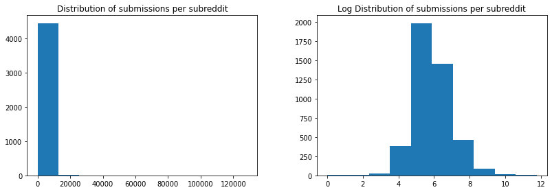
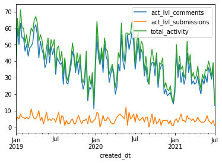
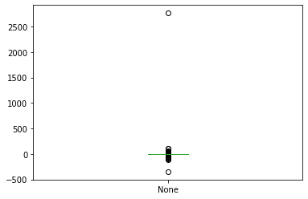
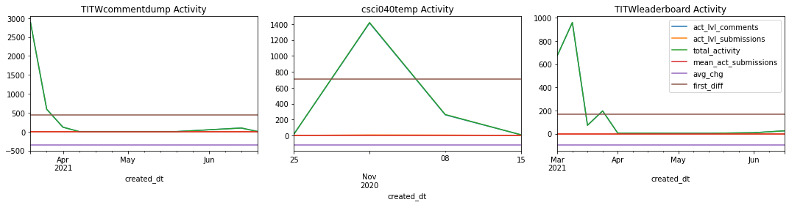
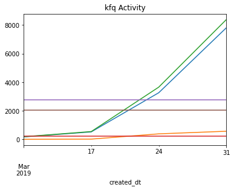
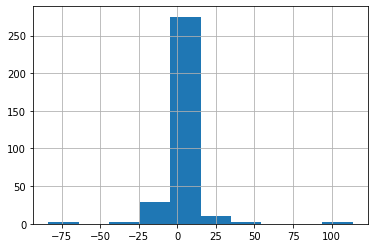
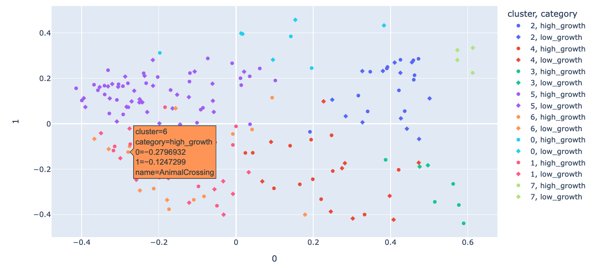
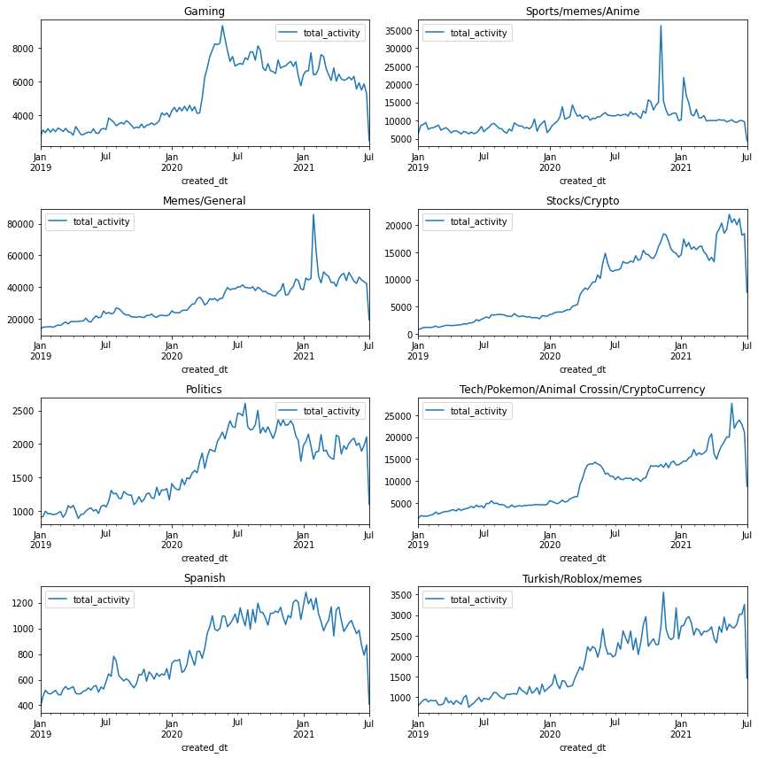
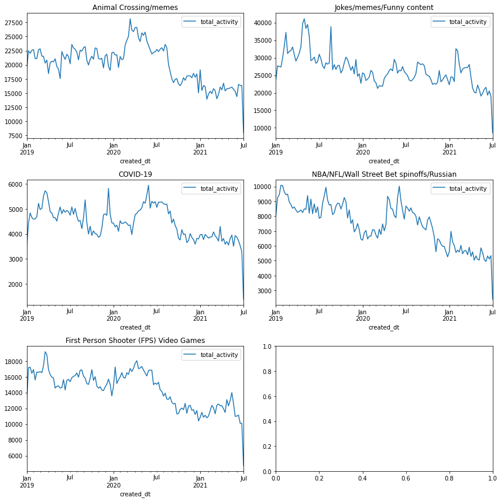

## Analysis of activity shifts on reddit

In this work, I take a look at the changes in subreddit activity levels, how they shifted and whether certain communities on reddit shifted together. 

## Abstract

The year 2019 to 2021 has seen countless events with global ramifications. As individuals become increasingly interconnected online through social media, it raises questions about how they are interacting with one another on these platforms and why. To understand these changes is to understand what people find most interesting or important, and how they feel about them. In this work, we will take a stab at answering this question by examining a subset of ~5000 reddit communities and the changes in activity level within them, as well as whether the sentiment associated with the activity is positive or negative. We will look at subreddits that have grown in size, and those that have contracted separately, and try to understand what sets them apart. We will then identify whether the activity through the grown/contraction phases is largely related to positive or negative sentiment, time permitting.

# Hypothesis: Activity level changes in subreddits are positively correlated with the degree of positive or negative sentiment associated with the activity.

### Research questions:

1. What are the similarities shared between subreddits that experienced similar activity level changes?  
  * Did the ones that grew/contracted:
    - experience that growth during similar time periods, and are there any reasons why?  
    - share common topics?
2. What kind of sentiment can we relate to subreddits that experienced similar activity level changes?  
  * Was there any sentiment associated with these changes?  
  * Was growth/contraction associated with very positive/negative sentiments? (I.e. Was the change driven by love/attraction or by hate/repulsion?)  

### The data

In this analysis we use two filtered and cleaned data sources, `text_comments.csv.gz` and `text_submissions.csv.gz` as provided generously by my course professor. They contain the top ~5000 subreddits, which detail all the comments and submissions from January 2019 to June 2021. 

#### Column Schema
For both comments and submissions:  
- `id`: a unique id for the item  
- `score`: score of the item (upvotes minus downvotes, with some algorithmic ‘fuzzing’ applied)  
- `author`: username of the user who posted the item, can be ‘[deleted]’ if an item has been deleted from its authors’ profile, or ‘AutoModerator’ if posted by the AutoModerator bot  
- `subreddit`: name of the subreddit the item was posted in  
- `created_utc`: time the item was posted, in Unix time  

For comments only:
- `link_id`: id of the link to which this comment belongs  
- `body`: textual content of the comment  

For submissions only:
- `is_self`: True if a submission is a text-only ‘self-post’, False if the submission is a link  
- `domain`: domain of the link  
- `title`: title of the submission  
- `selftext`: content of the self-post  

Let's take a look at the first 5 rows of data in our two data sources, `text_comments.csv.gz` and `text_submissions.csv.gz`

#### Comment text data

<div>
<table border="1" class="dataframe">
  <thead>
    <tr style="text-align: right;">
      <th></th>
      <th>id</th>
      <th>score</th>
      <th>link_id</th>
      <th>author</th>
      <th>subreddit</th>
      <th>body</th>
      <th>created_utc</th>
    </tr>
  </thead>
  <tbody>
    <tr>
      <th>0</th>
      <td>t1_ftjl56l</td>
      <td>4.0</td>
      <td>t3_gzv6so</td>
      <td>mega_trex</td>
      <td>BeautyGuruChatter</td>
      <td>Does anyone have a good cruelty free one? The ...</td>
      <td>1.591756e+09</td>
    </tr>
    <tr>
      <th>1</th>
      <td>t1_ftjpxmc</td>
      <td>6.0</td>
      <td>t3_gzv6so</td>
      <td>[deleted]</td>
      <td>BeautyGuruChatter</td>
      <td>(stares at my soft glam i've had for like 3 ye...</td>
      <td>1.591758e+09</td>
    </tr>
    <tr>
      <th>2</th>
      <td>t1_gzzxfyt</td>
      <td>22.0</td>
      <td>t3_nodb9e</td>
      <td>divadream</td>
      <td>BeautyGuruChatter</td>
      <td>When Jen’s initial reactions came out to the s...</td>
      <td>1.622398e+09</td>
    </tr>
    <tr>
      <th>3</th>
      <td>t1_gzzy7nc</td>
      <td>92.0</td>
      <td>t3_no6qaj</td>
      <td>Ziegenkoennenfliegen</td>
      <td>BeautyGuruChatter</td>
      <td>I think you mean a \n&gt;Highschool *fucking* bully</td>
      <td>1.622399e+09</td>
    </tr>
    <tr>
      <th>4</th>
      <td>t1_h00tpbp</td>
      <td>82.0</td>
      <td>t3_nolx7p</td>
      <td>meowrottenralph</td>
      <td>BeautyGuruChatter</td>
      <td>Ugh. I was honestly hoping that this brand wou...</td>
      <td>1.622415e+09</td>
    </tr>
  </tbody>
</table>
</div>
Which contains (46413725, 7) rows and columns respectively.

#### Submission/Post Text Data

<div>
<table border="1" class="dataframe">
  <thead>
    <tr style="text-align: right;">
      <th></th>
      <th>id</th>
      <th>author</th>
      <th>created_utc</th>
      <th>domain</th>
      <th>is_self</th>
      <th>score</th>
      <th>selftext</th>
      <th>title</th>
      <th>subreddit</th>
    </tr>
  </thead>
  <tbody>
    <tr>
      <th>0</th>
      <td>t3_npxigk</td>
      <td>All_Consuming_Void</td>
      <td>1622563615</td>
      <td>self.BeautyGuruChatter</td>
      <td>True</td>
      <td>0.0</td>
      <td>[removed]</td>
      <td>Hyram launches his own brand</td>
      <td>BeautyGuruChatter</td>
    </tr>
    <tr>
      <th>1</th>
      <td>t3_nqj6bf</td>
      <td>AutoModerator</td>
      <td>1622631621</td>
      <td>self.BeautyGuruChatter</td>
      <td>True</td>
      <td>38.0</td>
      <td>What are the influencers trying to influence y...</td>
      <td>What I'm not gonna buy Wednesday - Anti-haul</td>
      <td>BeautyGuruChatter</td>
    </tr>
    <tr>
      <th>2</th>
      <td>t3_nk0btr</td>
      <td>barrahhhh</td>
      <td>1621869439</td>
      <td>reddit.com</td>
      <td>False</td>
      <td>144.0</td>
      <td>NaN</td>
      <td>Plouise goes off in facebook group for 'bullying'</td>
      <td>BeautyGuruChatter</td>
    </tr>
    <tr>
      <th>3</th>
      <td>t3_nrbybs</td>
      <td>[deleted]</td>
      <td>1622722260</td>
      <td>self.BeautyGuruChatter</td>
      <td>True</td>
      <td>2.0</td>
      <td>[deleted]</td>
      <td>Is youtube algorithm against Susan Yara? She g...</td>
      <td>BeautyGuruChatter</td>
    </tr>
    <tr>
      <th>4</th>
      <td>t3_nl0ebd</td>
      <td>carlosShook</td>
      <td>1621977767</td>
      <td>vm.tiktok.com</td>
      <td>False</td>
      <td>0.0</td>
      <td>NaN</td>
      <td>Sephora steals concept from Huntr Faulknr afte...</td>
      <td>BeautyGuruChatter</td>
    </tr>
  </tbody>
</table>
</div>

Which contains (3496180, 9) rows and columns respectively.


We have a **LOT** of data here. A brief look at our data tells us we have over **46 million comments**, which belong to almost **3.5 million posts**. Those 3.5 million posts belong to **4,465 subreddits**. (And this data is already a subset of all of reddit)

We clearly have a lot of data to work with, but due to the time contraints associated with this project it would be best to narrow down a research question and take a subset of this data.

I'll now take a look at the distribution of the number of posts per subreddit.



This data is very hard to read, as most subreddits have less than 20,000 posts but there are a few that reach around 120,000 in this subset. Lets take a look at the log distribution of the data, which spreads out the distribution of subreddits if they have a small number of posts and condenses the distribution of subreddits that have a lot of posts.

From this analysis, we can see a normal distribution starting to appear! Most of our data has around $e^5$ to $e^7$ number of posts. 

## Research Question 1.

To answer our first research question, we have to first look at  **How have subreddits grown and shrunk over the two years**.
We want to see if there exists any trends in groups of subreddits that have grown or contracted together, and whether those growths or contractions are associated with positive or negative sentiments. For example, Formula One has seen large growth over the 2019-2021 time period due to the release of the _Drive to Survive_ Netflix show, attracting lots of new fans. An growth event in the Formula One subreddit should be expected come with positive sentiment.

In order to perform this analysis, we'll first have to make sure the dates in our data are properly processed. The ```created_utc``` is currently in Unix time, so I have converted it to a standard, readable time format.

### Calculating activity level changes through the date range given for each subreddit

Define activity level here as `# posts + # comments = activity level`. We'll leave the individual activity levels as they are for now, and create a new column that merges them in our new aggregated dataset.

Since we have such high resolution data for `created_utc` (times down to the second!), we will aggegrate up so we can see get the bigger picture of activity levels. Since it is more than 2 years worth of data, we can aggregate activity level by week. This preserves volatility within months but cutting down the number of value we have to deal with by a lot. There could have been some days that had no posts but had comments, or vice versa.

We can preform these actions for each dataset separately, before merging it all into a dataset with weeks as our rows and activity levels for both submissions and comments as columns all grouped by subreddit.

### Summary of activity within subreddits

The following table shows us that most subreddits had over 3,100 comments and 319 posts/submissions over the past 2 and a half years.

<div>
<table border="1" class="dataframe">
  <thead>
    <tr>
      <th></th>
      <th colspan="2" halign="left">act_lvl_comments</th>
      <th colspan="2" halign="left">act_lvl_submissions</th>
      <th colspan="2" halign="left">total_activity</th>
    </tr>
    <tr>
      <th></th>
      <th>sum</th>
      <th>mean</th>
      <th>sum</th>
      <th>mean</th>
      <th>sum</th>
      <th>mean</th>
    </tr>
  </thead>
  <tbody>
    <tr>
      <th>count</th>
      <td>4.474000e+03</td>
      <td>4474.000000</td>
      <td>4474.000000</td>
      <td>4474.000000</td>
      <td>4.474000e+03</td>
      <td>4474.000000</td>
    </tr>
    <tr>
      <th>mean</th>
      <td>8.386609e+03</td>
      <td>72.432462</td>
      <td>780.684175</td>
      <td>6.525290</td>
      <td>9.167293e+03</td>
      <td>78.957752</td>
    </tr>
    <tr>
      <th>std</th>
      <td>3.653893e+04</td>
      <td>299.227174</td>
      <td>2976.810469</td>
      <td>23.657839</td>
      <td>3.912499e+04</td>
      <td>319.474804</td>
    </tr>
    <tr>
      <th>min</th>
      <td>2.540000e+02</td>
      <td>3.135802</td>
      <td>0.000000</td>
      <td>0.000000</td>
      <td>2.570000e+02</td>
      <td>3.172840</td>
    </tr>
    <tr>
      <th>25%</th>
      <td>1.737000e+03</td>
      <td>14.139313</td>
      <td>181.000000</td>
      <td>1.470781</td>
      <td>1.973250e+03</td>
      <td>16.167939</td>
    </tr>
    <tr>
      <th>50%</th>
      <td>2.912500e+03</td>
      <td>24.007634</td>
      <td>319.500000</td>
      <td>2.574721</td>
      <td>3.300000e+03</td>
      <td>27.142227</td>
    </tr>
    <tr>
      <th>75%</th>
      <td>6.271500e+03</td>
      <td>52.030395</td>
      <td>662.000000</td>
      <td>5.406489</td>
      <td>6.981750e+03</td>
      <td>57.756268</td>
    </tr>
    <tr>
      <th>max</th>
      <td>1.895300e+06</td>
      <td>14467.938931</td>
      <td>128332.000000</td>
      <td>979.633588</td>
      <td>2.023632e+06</td>
      <td>15447.572519</td>
    </tr>
  </tbody>
</table>
</div>

Lets take a look at the first subreddit to see how our data looks!



For this particular subreddit we can see that as time went on, total activity levels have dropped over time. Notice that most of the volatility is due to the comment activity fluctuations. We can also observe that around new years, activity levels peak and then drops back down.

### Measuring activity level growth and contraction

With this data, we can easily calculate changes in activity level and group subreddits based on their respective level of change. We'll calculate the overall trend using linear regression over the entire time period for each subreddit, which will serve as our average change over time.

Diving deeper into the data, we see exactly which subreddits had the most contraction and most growth:

<div>
<table border="1" class="dataframe">
  <thead>
    <tr style="text-align: right;">
      <th></th>
      <th>Average change in overall activity per week</th>
    </tr>
    <tr>
      <th>subreddit</th>
      <th></th>
    </tr>
  </thead>
  <tbody>
    <tr>
      <th>TITWcommentdump</th>
      <td>-348.1786</td>
    </tr>
    <tr>
      <th>csci040temp</th>
      <td>-117.8000</td>
    </tr>
    <tr>
      <th>TITWleaderboard</th>
      <td>-96.2667</td>
    </tr>
    <tr>
      <th>pan_media</th>
      <td>-83.5325</td>
    </tr>
    <tr>
      <th>WallStreetbetsELITE</th>
      <td>-69.4371</td>
    </tr>
    <tr>
      <th>...</th>
      <td>...</td>
    </tr>
    <tr>
      <th>SHIBArmy</th>
      <td>39.5613</td>
    </tr>
    <tr>
      <th>wallstreetbets</th>
      <td>54.2944</td>
    </tr>
    <tr>
      <th>amcstock</th>
      <td>100.5929</td>
    </tr>
    <tr>
      <th>Superstonk</th>
      <td>113.6901</td>
    </tr>
    <tr>
      <th>kfq</th>
      <td>2766.8000</td>
    </tr>
  </tbody>
</table>
<p>4474 rows × 1 columns</p>
</div>

<div>
<table border="1" class="dataframe">
  <thead>
    <tr style="text-align: right;">
      <th></th>
      <th>Average change in overall activity per week</th>
    </tr>
  </thead>
  <tbody>
    <tr>
      <th>count</th>
      <td>4474.000000</td>
    </tr>
    <tr>
      <th>mean</th>
      <td>0.604920</td>
    </tr>
    <tr>
      <th>std</th>
      <td>41.930156</td>
    </tr>
    <tr>
      <th>min</th>
      <td>-348.178600</td>
    </tr>
    <tr>
      <th>25%</th>
      <td>-0.041750</td>
    </tr>
    <tr>
      <th>50%</th>
      <td>0.075600</td>
    </tr>
    <tr>
      <th>75%</th>
      <td>0.220800</td>
    </tr>
    <tr>
      <th>max</th>
      <td>2766.800000</td>
    </tr>
  </tbody>
</table>
</div>

Looking at a box plot of the average change per week, we see that we have a huge outlier with a growth rate of 2766 in our data. 



We'll examine that one subreddit later on.

Lets plot a histogram of the average slope to analyze the distribution, omitting the outlier at 2766


We can see that **most** subreddits experiences little to no change at all, as the high bar in the middle at 0 represents most of the subreddits.

### Subdividing and filtering subreddits

#### Filtering
What we want to do now is split subreddits into those that grew in activity level, and those that contracted. I also want to filter out any subreddits that didn't have much activity at all.

The platform shows posts(submissions) filtered based a couple categories. The "hot" filter orders posts by most upvotes recently to least. The "new" filter orders posts by newest to oldest. The "top" filter orders posts by highest total number of votes to least. Lastly, the "rising" filter predicts which posts will be "successful" (in their words) based on post age, subreddit size, and votes per minute.

From my personal experience, I mainly use the hot and new filters while only occasionally using the top filter. This means that my interactions with subreddits are generally with current posts. Based on this assumption, it would imply subreddits with few or no posts per week don't generate as much interaction as those that do have many posts per week. This tells me that I only want to look at subreddits that have at least 5 posts a week on average. I will classify any subreddit with less posts per week on average as *too small*.

According to the previous `Summary of activity within subreddits` output, this measure corresponds with subreddits above the **75th percentile**, with a mean submission per week number of ~5 posts.

We also want to filter out any subreddits that didn't change much at all. To just filter out subreddits with a mean slope around 0 would ignore subreddits whose activity climbed and dropped by the same amount, over the same time frame lengths. To counteract this, we will filter out subreddits with a low **absolute sum** of the first differences in activity levels along with any subreddits with a slope within -1 and 1. These restrictions mean we will effectively be excluding 90% of our data. (This is helpful from both an interpretation perspective and computation perspective.)

This table shows some of the sites we have remaining after filtering:

<div>
<table border="1" class="dataframe">
  <thead>
    <tr style="text-align: right;">
      <th></th>
      <th>subreddit</th>
    </tr>
  </thead>
  <tbody>
    <tr>
      <th>0</th>
      <td>196</td>
    </tr>
    <tr>
      <th>1</th>
      <td>2007scape</td>
    </tr>
    <tr>
      <th>2</th>
      <td>ACNHvillagertrade</td>
    </tr>
    <tr>
      <th>3</th>
      <td>ACTrade</td>
    </tr>
    <tr>
      <th>4</th>
      <td>ACVillager</td>
    </tr>
    <tr>
      <th>...</th>
      <td>...</td>
    </tr>
    <tr>
      <th>321</th>
      <td>wallstreetbets</td>
    </tr>
    <tr>
      <th>322</th>
      <td>wholesomememes</td>
    </tr>
    <tr>
      <th>323</th>
      <td>wildrift</td>
    </tr>
    <tr>
      <th>324</th>
      <td>worldnews</td>
    </tr>
    <tr>
      <th>325</th>
      <td>yeagerbomb</td>
    </tr>
  </tbody>
</table>
<p>326 rows × 1 columns</p>
</div>

## Dividing subreddits into chunks

All this prep work was done in order to help us analyze the ways that subreddits grew and contracted over time. So naturally we want to understand why some subreddits grew and why some subreddits shrank. 

_(We won't be looking at those that didnt really change in activity level.)_

To understand the intricacies between subreddits, we need to increase the resolution of our data and one way to do that is to group subreddits by their _level_ of change, as determined by which percentile they lie in. Due to the fact we have 326 subreddits to work with after filtering, we will settle with the splitting both the growing and contracting datasets into halves: 

- **Growth**
 -  **High Growth, Low Growth**
 - Growth Threshold: 2.01
  * This threshold determines whether a subreddit belongs in the high or low growth category
- **Contraction**
 -  **High Contraction, Low Contraction**
 - Contraction Threshold: -2.44
   * This threshold determines whether a subreddit belongs in the high or low contraction category


### Growth subreddits

Here we look at the distribution of average activity level change in contracted subreddits.

**Add in describe table here**

It seems that we've been able to capture all the subreddits with growth, even subreddit with the largest overall growth.

### High growth Subreddits

Here are some of the high growth subreddits:

- MAAU
- wildrift
- lgbt
- PoliticalHumor
- politics
- nottheonion
- mechmarket
- NoStupidQuestions
- Whatcouldgowrong
- Genshin_Impact
- SHIBArmy
- wallstreetbets

### Low Growth Subreddits

Here are some of the low growth subreddits:

- cats
- formuladank
- dating_advice
- PersonalFinanceCanada
- h3h3productions
- playstation
- italy
- WatchPeopleDieInside
- fivenightsatfreddys
- LifeProTips
- FemaleDatingStrategy
- nvidia


### Contracted subreddits

Here we look at the distribution of average activity level change in contracted subreddits.

<div>
<table border="1" class="dataframe">
  <thead>
    <tr style="text-align: right;">
      <th>Statistics</th>
      <th></th>
    </tr>
  </thead>
  <tbody>
    <tr><th>count</th>
<td>15307.00</td>
    </tr>
    <tr>
<th>mean</th>
<td>-4.12</td>
    </tr>
    <tr>
<th>std</th>
<td>7.01</td>
    </tr>
    <tr>
<th>min</th>
<td>-83.53</td>
    </tr>
    <tr>
<th>25%</th>
<td>-3.748400</td>
    </tr>
    <tr>
<th>50%</th>
<td>-2.28</td>
    </tr>
    <tr>
<th>75%</th>
<td>-1.46</td>
    </tr>
    <tr>
<th>max</th>
<td>-1.01</td>
    </tr>
  </tbody>
</table>
<p>326 rows × 1 columns</p>
</div>
    
Comparing our previous results to this table of average changes, it seems we're missing the top three subreddits with the largest change.



The bulk of activity in _TITWcommentdump_ and _TITWleaderboard_ occured in early 2021, dying off really quickly. A quick google tells us that people essentially spam _"THIS IS THE WAY"_ in posts and comments, and the leaderboard subreddit tracks who spammed that phrase the most. This subreddit seems to be related to __The Mandalorian__, as _"This is the way"_ is one of the shows iconic phrases. 

_csci40temp_ is a subreddit used by students of a computer science course where they can spam/test bots. This makes sense as activity within this subreddit was short-lived. They are rightfully excluded by our filter.

Let's continue with our analysis, starting off with the high contraction followed by low contraction datasets.

### High Contraction Subreddits

Here are some of the high contraction subreddits:

- Coronavirus
- GME
- AskReddit
- dankmemes
- funny
- me_irl
- gaming
- worldnews
- entitledparents
- CFB
- ukpolitics
- smashbros

### Low Contraction Subreddits

Here are some of the low contraction subreddits:

- Warframe
- AnimalsOnReddit
- COVID19
- mildlyinteresting
- Overwatch
- dank_meme
- MurderedByWords
- leagueoflegends
- comedyheaven
- teslamotors
- Borderlands
- atheism

### The outlier

As per the average change analysis, we know there's a huge activity level outlier: the one subreddit **kfq**, that saw an average activity level growth of 2766. This subreddit is mainly in chinese. It's description is:

_"The Wandering KFQ @ 20190301. Here is a mirror sub of a Chinese community which has been closed by censorship problem."_



We can reasonably assume the huge activity is due to the migration of posts from the original subreddit, and is used purely to store posts since was no new posts as of March 31st, 2019.

We will exclude that subreddit so that we can see differences in activity level change between the rest of the subreddits in a clearer fashion.

After collecting average changes for each subreddit and removing the outlier, this is now our distribution of change!



We can see that there are still lots of subreddits with average change around 0, but we know they are all above |1| based on our filtering.

## Subreddit clustering by submission text

Now that we've finally cleaned and organized our subreddits, we want to be able to cluster the subreddits in each group together and examine the similarities they share. This is in an effort to understand why they have shared the same growth numbers.

**I've decided not to include comment text in my word embeddings, due to the fact comments commonly stray off topic and are more related to personal experiences rather than the submission/post. The post itself is more reliably related to the given subreddit, since many subreddits have rules on what can and cannot be posted within them.**

We are essentially gathering all the words associated to a given subreddit into one column on which we can create __bag of words__ vectors. We will then feed that matrix into the _**t**erm **f**requency - **I**nverse **D**ocument **F**requency_ **(tf-IDF) transformer** which augments the bag of words matrix by giving less weight to common words to improve the amount of information we can obtain.

Below I've joined all the text within the ```title``` and ```selt_text``` columns from every submission into one column for every subreddit. The `text` column is what we will perform the bag of words algorithm from `sklearn.feature_extraction.text` called `CountVectorizer`.

<div>
<table border="1" class="dataframe">
  <thead>
    <tr style="text-align: right;">
      <th></th>
      <th>text</th>
      <th>avg_chg</th>
      <th>category</th>
    </tr>
    <tr>
      <th>subreddit</th>
      <th></th>
      <th></th>
      <th></th>
    </tr>
  </thead>
  <tbody>
    <tr>
      <th>196</th>
      <td>\n\n[View Poll](https://www.reddit.com/poll/np...</td>
      <td>27.8067</td>
      <td>high_growth</td>
    </tr>
    <tr>
      <th>2007scape</th>
      <td>looking for some west coasters to personally a...</td>
      <td>-1.7927</td>
      <td>low_contract</td>
    </tr>
    <tr>
      <th>ACNHvillagertrade</th>
      <td>Pink hippo bitty in boxes heavily gifted I don...</td>
      <td>-1.5510</td>
      <td>low_contract</td>
    </tr>
    <tr>
      <th>ACTrade</th>
      <td>Howdy all! I haven’t played AC for about a yea...</td>
      <td>4.7686</td>
      <td>high_growth</td>
    </tr>
    <tr>
      <th>ACVillager</th>
      <td>Currently can do 10 NMT and 3 Million Bells or...</td>
      <td>-6.2110</td>
      <td>high_contract</td>
    </tr>
    <tr>
      <th>...</th>
      <td>...</td>
      <td>...</td>
      <td>...</td>
    </tr>
    <tr>
      <th>wallstreetbets</th>
      <td>Let me introduce you to the ratio spread.\n\nT...</td>
      <td>54.2944</td>
      <td>high_growth</td>
    </tr>
    <tr>
      <th>wholesomememes</th>
      <td>Every shitty horror movie you’re doing just f...</td>
      <td>-1.5314</td>
      <td>low_contract</td>
    </tr>
    <tr>
      <th>wildrift</th>
      <td>https://ibb.co/3NLSm9G\n\nNothing impressive t...</td>
      <td>1.8571</td>
      <td>low_growth</td>
    </tr>
    <tr>
      <th>worldnews</th>
      <td>[removed]\n\n[View Poll](https://www.reddit.co...</td>
      <td>-3.4403</td>
      <td>high_contract</td>
    </tr>
    <tr>
      <th>yeagerbomb</th>
      <td>What I love about Eldia is I just get to be m...</td>
      <td>5.3669</td>
      <td>high_growth</td>
    </tr>
  </tbody>
</table>
<p>326 rows × 3 columns</p>
</div>

### Visualizing our subreddits

So we've created a tf-IDF matrix based on the `text` column above. What now? Well because each subreddit is now represented by 500 words, we can think of all our subreddits residing in a 500 dimensional space. Thats crazy! Theres no way we can look at 500 dimensions at once, so in order to make the digestion of our data easier, we'll use **Principle Components Analysis (PCA)** to find a way to reduce that all the dimensions down into just 10, and we will subsequently look at the top 2 dimensions (which capture the most variance in the data).

Using K-Means, we're able cluster subreddits together based on their tf-IDF matrices after performing dimensionality reduction on them. We can see that the clusters below don't really care whether a subreddit grew by a lot, or not by much.

What the following plots do is group subreddits together into topics. We will start off by examining the subreddits that experienced growth.

#### Subreddits that experienced growth

<iframe id="igraph" scrolling="no" style="border:none;" seamless="seamless" src="cluster_growth_new.html" height="725" width="120%"></iframe>  

It's much harder to distinguish groups within the growth subreddits, as they are made up of many different online communities. I attempt to classify them below:

| Cluster Number | Cluster Colour | Potential Grouping |
| :-: | :-: | :-: |
| 5 | Purple | Memes/General |
| 0 | Cyan | Politics |
| 2 | Blue | Tech/Pokemon/Animal Crossin/CryptoCurrency |
| 7 | Light Green | Spanish |
| 6 | Orange | Gaming |
| 1 | Pink | Sports/memes/Anime |
| 4 | Red | Stocks/Crypto |
| 3 | Green | Turkish/Roblox/memes |

### Subreddits that experienced contraction

<iframe id="igraph" scrolling="no" style="border:none;" seamless="seamless" src="InteractivePlots/cluster_contract.html" height="725" width="120%"></iframe>  

On the left, we have a cluster of primarily gaming subreddits in green. They had a mix of low and high contraction in activity levels. These games however seemed to belong to a sub-category of big name FPS games, such as Overwatch, Call of Duty: Cold War, Battlefield V, The Last of Us 2, and Destiny. 

In purple, we have a variety of subreddits, from sports like NBA and NFL, to r/wallstreetbets spinoffs like Wallstreetsilver and WallStreebetsELITE. This cluster is not very cohesive, so it is hard derive any insight from it.

Near the bottom, we have a red cluster of primarily joke/meme/funny topic related subreddits such as TheMemersClub, dankmemes, wholesomememes as well as some shows such as WANDAVISION, gameofthrones, and rupaulsdragrace.

On the right, we have a cluster of blue subreddits which don't seemingly relate to eachother as they contain subreddits focused on the Animal Crossing game such as ACVillager, ACNHvillagertrade, AnimalCrossingTrading, AnimalCrossingNewHor, and TurnipExchange while also containing various subreddits from other topics such as todayilearned and MemeEconomy.

On the right we also have a tiny orange cluster of subreddits almost exclusively dedicated to the COVID-19 pandemic/world news.

| Cluster Number | Cluster Colour | Potential Grouping |
| :-: | :-: | :-: |
| 2| Green | First Person Shooter (FPS) Video Games |
| 4| Purple | NBA/NFL/Wall Street Bet spinoffs/Russian |
| 1| Red | Jokes/memes/funny |
| 3| Blue | Animal Crossing/memes |
| 0| Orange | COVID-19 |


As we can see, there are some clear topics/communities that contracted such as COVID-19, FPS Video Games while some clear communities that grew such as politics, stocks/cryptocurrency, and other gaming categories.

We could probably explain the decline in COVID-19 related subreddits as people got tired of talking and hearing about the on-going pandemic. As restrictions lifted, people could have played less video games (specifically FPS games and Animal Crossing) resulting in related subreddits to decrease in activity as well. Interestingly, the actual Animal Crossing subreddit had high growth in activity level, even though it's related subreddits decreased in activity level.



# Analyzing the growth patterns of each cluster

## Growth clusters



## Contraction clusters



### Analysis of the community activity plots

This is a lot of data to digest! Here are some thoughts:

#### Growth 

Starting off with the communities/clusters of subreddits that grew, we see that the Tech/Pokemon/Animal Crossing/CryptoCurrency and Stocks/Crypto Currency clusters grew quite similarly, but thats most likely due to the fact they both contained similar subreddits. The rest of the subreddit clusters don't share many similarities in when they grew, so unfortunately we cannot make any insight into whether certain clusteres of communities on reddit grew.

What we can observe from these graphs is the jump in activity in almost all the clusters around early 2020, between January and July. This correlates well with when COVID-19 lockdowns started to be put in place around the world.

#### Contraction

Less clusters worked better in terms of clustering subreddits that contracted, since in the first two dimensions of our submission text embedding space the subreddits appeared to have some sem-distinct groupings already. 

Also very similarly to the growth category of subreddits, we see a jump in activity early 2020 between January and July as well for these subreddits. Albeit with this group on subreddits, it doesn't seem as though that was enough to spur new activity in these subreddits. 

## Conclusion of part 1: Analysis of similarities between subreddits that changed together over January 2019 - June 2021.

So to conclude this section, we did quite a bit of data cleaning and separation. We first calculated the average rate of change in the amount of submissions and comments in each subreddit which we rolled up into ```total_activity```. We then filtered out subreddits that didn't change much over the time span of data we have, and subsequently separated them into groups of sub-reddits that grew, and subreddits that contracted. After figuring out which subreddits we want to analyze, we were able to obtain all the submission text (including titles of posts and the content, if any, attached) and construct a tf-IDF matrix. 

### The NLP analysis
This matrix represents each subreddit by a vector of 500 words, which more "important" words weighing more than common words. Using this we performed PCA analysis to identify 10 dimensions that capture the most variance between the subreddits, visualizing the top 2. We clustered subreddits together based on these 10 dimensions using the KMeans algorithm, and tried our best to interpret the clustering. From there we examined how each of our clusters changed in ```total_activity``` in relation to eachother. We were unable to identify any strong similarities between subreddits, **but** all subreddits _grew_ in early 2020, between January and June as lockdowns around the world started being put in place.

### Comment data

Due to time constraints, I will not be using the comment text data for the sentiment analysis even though it provides a lot of information due to the time constraints with this project. It would involve running ~2.8gb of data through a sentiment processor, and that will take too long to run.

# Part 2: Sentiment Analysis

In the following section, we'll take a look at the sentiment associated with the growth and contraction groups of subreddits respectively to determine whether there was any sentiment associated with the growth or decline in activity level.

To do this, we will be using the `SentimentIntensityAnalyzer` powered by the popular vader lexicon from `nltk.sentiment`.

## Subreddits that grew

<iframe id="igraph" scrolling="no" style="border:none;" seamless="seamless" src="InteractivePlots/prop_sentiment_growth.html" height="725" width="120%"></iframe>  
From the left, we see the subreddit with the most postiive sentiment also has the most negative sentiment. A deeper dive into [r/TIHI](https://www.reddit.com/r/TIHI/) shows that its generally about things people hate, and asks for otheres opinion on whether their opinion is justified. It seems that the subreddit itself is negative, but with the "Thanks..." required in each submission, it seems as though positive and negative sentiments have been balanced out. 

We can also examine the average sentiment statistics:

<div>
<table border="1" class="dataframe">
  <thead>
    <tr style="text-align: right;">
      <th></th>
      <th>neg</th>
      <th>neu</th>
      <th>pos</th>
    </tr>
  </thead>
  <tbody>
    <tr>
      <th>count</th>
      <td>185.000000</td>
      <td>185.000000</td>
      <td>185.000000</td>
    </tr>
    <tr>
      <th>mean</th>
      <td>0.095876</td>
      <td>0.765146</td>
      <td>0.138962</td>
    </tr>
    <tr>
      <th>std</th>
      <td>0.049683</td>
      <td>0.079701</td>
      <td>0.048680</td>
    </tr>
    <tr>
      <th>min</th>
      <td>0.005000</td>
      <td>0.274000</td>
      <td>0.005000</td>
    </tr>
    <tr>
      <th>25%</th>
      <td>0.064000</td>
      <td>0.725000</td>
      <td>0.119000</td>
    </tr>
    <tr>
      <th>50%</th>
      <td>0.091000</td>
      <td>0.762000</td>
      <td>0.140000</td>
    </tr>
    <tr>
      <th>75%</th>
      <td>0.124000</td>
      <td>0.798000</td>
      <td>0.161000</td>
    </tr>
    <tr>
      <th>max</th>
      <td>0.409000</td>
      <td>0.991000</td>
      <td>0.317000</td>
    </tr>
  </tbody>
</table>
</div>

Based purely on sentiment, we have an average of 13.89% positive sentiment, and 9.58% negative sentiment. It appears there exists a bit more positive sentiment than negative sentiment within subreddits that grew.

## Subreddits that contracted

<iframe id="igraph" scrolling="no" style="border:none;" seamless="seamless" src="InteractivePlots/prop_sentiment_contract.html" height="725" width="120%"></iframe>  

Starting from the left side of this graph, we can see that r/wholesomememes had tons of positive sentiment related to it, which is understandable as being wholesome is central to what the community is, and being wholesome is trivially related to positive sentiment.

Further to the right, we can see a noticeable spike in negative sentiment in the r/MurderedbyWords subreddit, which is dedicated to comebacks and counter-argumemts. 

We can also examine the average sentiment statistics:

<div>
<table border="1" class="dataframe">
  <thead>
    <tr style="text-align: right;">
      <th></th>
      <th>neg</th>
      <th>neu</th>
      <th>pos</th>
    </tr>
  </thead>
  <tbody>
    <tr>
      <th>count</th>
      <td>140.000000</td>
      <td>140.000000</td>
      <td>140.000000</td>
    </tr>
    <tr>
      <th>mean</th>
      <td>0.099221</td>
      <td>0.754379</td>
      <td>0.146371</td>
    </tr>
    <tr>
      <th>std</th>
      <td>0.034446</td>
      <td>0.052458</td>
      <td>0.037560</td>
    </tr>
    <tr>
      <th>min</th>
      <td>0.003000</td>
      <td>0.609000</td>
      <td>0.007000</td>
    </tr>
    <tr>
      <th>25%</th>
      <td>0.079000</td>
      <td>0.726250</td>
      <td>0.131000</td>
    </tr>
    <tr>
      <th>50%</th>
      <td>0.098500</td>
      <td>0.755000</td>
      <td>0.147500</td>
    </tr>
    <tr>
      <th>75%</th>
      <td>0.119000</td>
      <td>0.780250</td>
      <td>0.165000</td>
    </tr>
    <tr>
      <th>max</th>
      <td>0.240000</td>
      <td>0.989000</td>
      <td>0.326000</td>
    </tr>
  </tbody>
</table>
</div>

If we look at the row that describes the mean, we can see that there is on average 14.63% positive sentiment associated with these subreddits and 9.92% negative sentiment. 

Based solely on this analysis, we see that the proportions of positive and negative sentiment are really similar between the subreddits that grew and those that contracted.

### T-tests on positive and negative sentiment between subreddits that grew and subreddits that contracted

- **P-value of positive sentiment t-test: 13.58%**
- **P-value of negative sentiment t-test: 49.56%**

From our t-tests of each negative and positive sentiment scores for each subreddit, we can see clearly from their p-values that they are both greater than 5%, which means we cannot reject the null hypothesis, which states that subreddits that contracted and grew should have the same negative and positive sentiment value on average.

Therefore we there does not exist enough statistically significant proof that subreddits that grew and subreddits that contracted are _different_ in terms of sentiment.

# Conclusion

We were able to find some interesting results with our analysis of the activity level changes between subreddits that grew and subreddits that contracted, and we were somewhat successful in clustering subreddits based on similar topics. We found that regardless of the overall activity change observed over the 2.5 years of data we have, there was a significant uptick in activity for all our filtered subreddits in early 2020, when COVID-19 lockdowns were being put in place around the world.

Based on our brief sentiment analysis of the sentiment associated with each subreddit's submissions, we cannot say whether _activity level changes in subreddits are positively correlated with the degree of positive or negative sentiment associated with the activity._ We have only seen that there seems to be more positive sentiment than negative sentiment associated with these all the subreddits we looked at. 

Therefore we cannot accept/reject our hypothesis, that **activity level changes in subreddits are positively correlated with the degree of positive or negative sentiment associated with the activity.**

Thank you for taking the time to read through my data story and coming along with me on this data journey. I hope you learned something new today!

If you'd like to learn more about me, check out my [video introduction](https://youtu.be/dQw4w9WgXcQ)
<br />
<br />
<br />
<br />
<br />
<br />
<br />
Or you could checkout my [personal website](https://richardye.netlify.app/)
